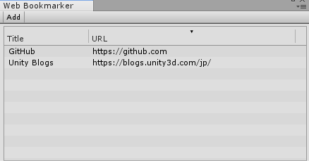
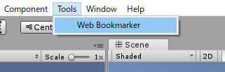
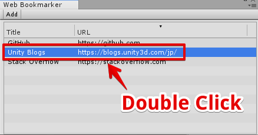
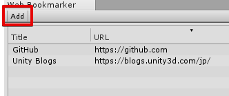
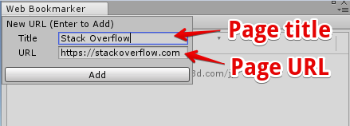
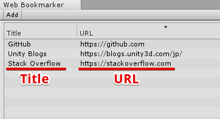
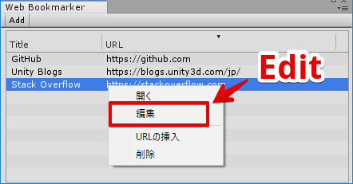
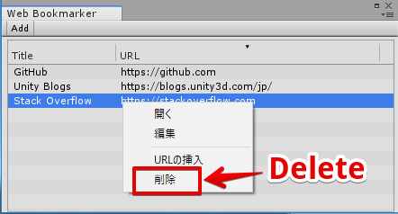

# Unity-WebBookmarker
Unity-WebBookmarker is a tool to bookmark URL.

# How to use
## Open Window
Select **"Tools/Web Bookmarker"**

## Open URL
Double click a row you want to open.

## Add URL
Click add button.

Enter url and title.

 
That's it!

## Edit URL
Right click and select **"編集"**.

## Delete URL
Right click and select **"削除"**.

